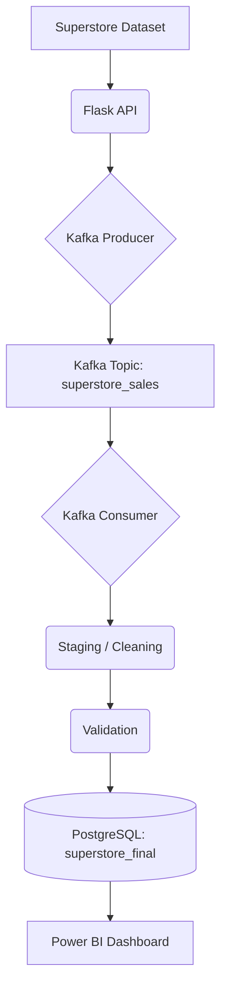

# Superstore ETL Pipeline

## 1. Project Objective
This project demonstrates an end-to-end data engineering pipeline for Superstore sales data. It ingests data via a Flask API, pushes it to a Kafka topic, consumes it into a staging area for cleaning and validation, and finally loads it incrementally into a PostgreSQL database, ready to be visualized in a Power BI dashboard.

## 2. Architecture


## 3. Technologies Used
- **Python**: Core programming language.
- **Flask**: Serves the Superstore dataset via an API.
- **Apache Kafka**: Message broker for data streaming.
- **Pandas**: Data manipulation and transformation.
- **SQLAlchemy & psycopg2**: PostgreSQL database connection and operations.
- **Apache Airflow**: Orchestration of the ETL pipeline.
- **Docker**: Containerization of Kafka, Zookeeper, and Airflow.
- **PostgreSQL**: Target database for the cleaned data.
- **Power BI**: Data visualization and dashboarding.
- **Git & GitHub**: Version control and code hosting (Added in Exercise 6).
- **Pytest**: Unit testing framework (Added in Exercise 6).
- **GitHub Actions**: Continuous Integration (CI) pipeline (Added in Exercise 6).

## 4. Components

### Flask API (`app.py`)
Serves the dataset and provides various endpoints. Modified to include a `POST /api/sales` endpoint to allow inserting new records into memory to demonstrate incremental loading.

### Kafka Producer (`producer.py`)
Fetches data from the `/api/sales` endpoint and publishes each record to the `superstore_sales` topic.

### Kafka Consumer (`consumer.py`)
Listens to the `superstore_sales` topic and writes the consumed messages into a `processed_superstore.csv` file. It uses `consumer_timeout_ms=5000` to exit cleanly when batch processing is done.

### Staging / Transformation (`staging.py`)
Reads the processed CSV, removes duplicates and missing values, formats column names (lowercasing and replacing spaces with underscores), and parses date columns into a `staging_superstore.csv` file. **Refactored in Exercise 6** to expose pure transformation functions for unit testing.

### Validation (`validation.py`)
Ensures data quality by checking for the presence of the `row_id` column, verifying no missing values remain, and no duplicate rows exist. Fails the Airflow task if these conditions aren't met. **Refactored in Exercise 6** to expose pure validation logic for unit testing.

### PostgreSQL Loading (`database.py`)
Reads the staging CSV and connects to the PostgreSQL database. It loads the data into a temporary table, then performs an `INSERT ... ON CONFLICT (row_id) DO UPDATE` query to merge the data into the `public.superstore_final` table. This ensures no duplicate records are created upon multiple runs (idempotency).

### Airflow Orchestration (`dags/pipeline_dag.py`)
Orchestrates the entire process sequentially: `run_producer` -> `run_consumer` -> `run_staging` -> `run_validation` -> `run_database`.

## 5. Incremental Data Flow
The pipeline identifies unique records using `row_id`. When new data is added, the pipeline processes the entire batch, but the PostgreSQL `ON CONFLICT` clause ensures that only new records are inserted and existing records are updated, preventing duplicates and keeping the Power BI dataset accurate.

## 6. How to Run the Project

1. **Start Docker Services**: Ensure your Docker containers for Kafka, Zookeeper, Airflow, and PostgreSQL (if applicable) are running using `docker-compose up -d`.
2. **Environment Variables**: Make sure the `.env` file has the correct `POSTGRES_USER` and `POSTGRES_PASSWORD` set for your database.
3. **Start Flask API**: Run `python app.py` in a separate terminal if it's not managed by Docker.

## 7. How to Trigger the Airflow DAG
1. Navigate to the Airflow UI (usually `http://localhost:8080`).
2. Turn on the `superstore_etl_pipeline` DAG.
3. Click the "Trigger DAG" (Play) button to start the execution manually.
4. Monitor the task progress in the Graph or Grid view until all tasks show Success.

## 8. How to Verify PostgreSQL
1. Open pgAdmin or any PostgreSQL client.
2. Connect to the `superstore_db` database.
3. Run `SELECT COUNT(*) FROM public.superstore_final;` to verify the total records.
4. Run `SELECT * FROM public.superstore_final ORDER BY row_id DESC LIMIT 10;` to view the latest records.

## 9. How to Demonstrate a New Record
To demonstrate the incremental pipeline working for your CAT project:
1. Open a terminal and run the following curl command to add a new record to the Flask API:
```bash
curl -X POST http://localhost:5000/api/sales \
-H "Content-Type: application/json" \
-d '{"Row ID": 99999, "Order ID": "CA-2026-999999", "Order Date": "2026-08-09", "Ship Date": "2026-08-11", "Ship Mode": "Second Class", "Customer ID": "CG-12520", "Customer Name": "Claire Gute", "Segment": "Consumer", "Country": "United States", "City": "Henderson", "State": "Kentucky", "Postal Code": 42420, "Region": "South", "Product ID": "FUR-BO-10001798", "Category": "Furniture", "Sub-Category": "Bookcases", "Product Name": "Bush Somerset Collection Bookcase", "Sales": 261.96, "Quantity": 2, "Discount": 0, "Profit": 41.9136}'
```
2. Trigger the Airflow DAG again.
3. Check PostgreSQL to verify the total row count has increased by 1 (or check for `row_id` 99999).

---

## Exercise 6: CI/CD and Version Control for Data

### Git Branching Strategy
This project follows a standard Git flow strategy appropriate for data engineering pipelines:
- `main`: The stable, production-ready code.
- `develop`: The active development branch integrating new features.
- `feature/ci-cd-testing`: The specific feature branch where Exercise 6 additions (testing and CI/CD) were developed before being merged back.

To push code changes:
1. `git add .`
2. `git commit -m "Your descriptive commit message"`
3. `git push origin feature/ci-cd-testing`

### Pipeline as Code & `.gitignore`
The pipeline is structured as code. The repository intentionally excludes sensitive files and large runtimes through a robust `.gitignore` file.
Excluded items include: `.env` (secrets), `*.db`, `airflow.db`, `__pycache__`, `venv`, and dynamically generated data outputs like `staging_superstore.csv`.
Only configuration, code scripts, `requirements.txt`, Dockerfiles, and DAGs are tracked.

### Unit Testing & Mock Testing
The core data transformations in `staging.py` and validation rules in `validation.py` were refactored into pure functions. This allowed the creation of isolated unit tests using Pytest, executed entirely in-memory using Pandas DataFrames without depending on external services like Kafka, Airflow, or PostgreSQL.

Tests include:
- **Transformations**: Column standardization, duplicate removal, date conversions, and missing-value handling.
- **Validations**: Passing on perfectly clean data, and accurately failing on duplicates, missing values, or missing `row_id`.
- **Edge cases**: Empty dataframes.

### How to Run Tests Locally
To execute the test suite, ensure your virtual environment is active and run:
```bash
python -m pytest -v tests/
```
All 10 tests are designed to pass autonomously.

### GitHub Actions CI Workflow
A Continuous Integration pipeline is established via `.github/workflows/ci.yml`.
This workflow is triggered on any `push` or `pull_request` to the `main` or `develop` branches.
The CI/CD runner operates on Ubuntu, sets up Python 3.9, installs `requirements.txt` dependencies, and executes `pytest`. This guarantees that transformation rules are intact before any pipeline changes are merged into the main codebase.
